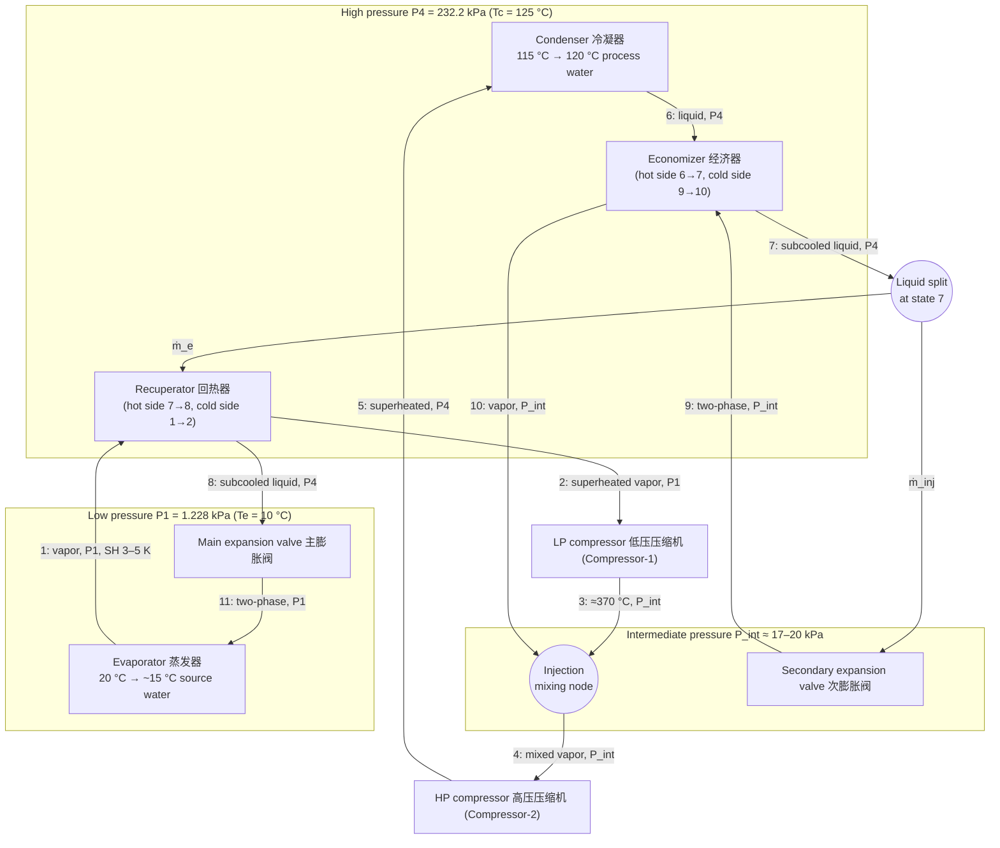

# 01 — System Overview and State-Point Definition

*This document establishes the physical context, the corrected canonical state-point map, the component-by-component cycle description, and the input-variable taxonomy for the two-stage R718 high-temperature heat pump. Every later document — property relations in [doc 02](02-water-properties.md), component models in [docs 03](03-compressor-models.md)–[05](05-valves-mixing-junctions.md), system coupling in [doc 06](06-cycle-coupling-steady-state.md), and the dynamic/control work in [docs 08](08-dynamic-model.md)–[09](09-control-design.md) — builds on the definitions fixed here.*

---

## 1.1 Application context: industrial heat above 120 °C with water as refrigerant

The system under study is a **two-stage vapor-compression high-temperature heat pump** using
**water (H₂O, refrigerant designation R718)** as the working fluid. It absorbs low-grade heat from
an environmental source — here source water at roughly 20 °C — and lifts it to a delivery
temperature above 120 °C, heating process water from 115 °C to ~120 °C in the condenser. Typical
target applications named in the task sheet are **industrial process heating** and
**high-temperature hot-water supply**; the same architecture underlies mechanical vapor
recompression (MVR), low-pressure steam generation, drying, sterilization, and distillation-reboil
duty — all sectors where 120–150 °C heat is today produced by gas boilers.

### 1.1.1 Why R718

Water is a *natural* refrigerant with a unique combination of properties for this temperature band:

| Property | Value | Consequence for this system |
|----------|-------|------------------------------|
| GWP / ODP | 0 / 0 | No F-gas regulation exposure, no phase-down risk |
| Cost, availability | essentially free | No charge-cost or leak-cost penalty |
| Safety class | non-flammable, non-toxic (A1) | No machinery-room ATEX/toxicity constraints |
| Critical point | 373.9 °C / 22.06 MPa | Condensing at 125 °C sits *far* below critical — subcritical cycle with a large, well-shaped saturation dome; no HFO or hydrocarbon reaches 125 °C condensing this comfortably |
| Latent heat at 120 °C | ≈ 2 200 kJ/kg | Roughly 10× that of synthetic refrigerants → very small mass flow (≈ 0.02 kg/s for 50 kW) |
| Triple point | 611 Pa / 0.01 °C | Hard lower bound on evaporating pressure; the evaporator already operates near it |

The same physics that makes water attractive also makes the machine unusual, and these
peculiarities drive the entire modeling effort:

- **Deep-vacuum evaporation.** At $T_e = 10\ ^\circ\mathrm{C}$ the saturation pressure is only
  $P_1 = 1.228$ kPa absolute. The suction specific volume is **≈ 106 m³/kg**, so the 50 kW design
  point moves ~1 m³/s (≈ 3 500 m³/h) of vapor — a volumetric-machine problem, not a mass-flow
  problem. The saturation-curve slope at 10 °C is $\mathrm{d}P_\mathrm{sat}/\mathrm{d}T \approx 82$
  Pa/K, so a mere 100 Pa of suction-line pressure drop costs ≈ 1.2 K of effective thermal lift.
  These facts are quantified from IAPWS-IF97 in [doc 02](02-water-properties.md).
- **Extreme discharge superheat.** Steam behaves nearly as an ideal gas with a low molar mass and
  a *large* $c_p/c_v$-driven temperature rise *per unit pressure ratio* compared with heavy synthetic
  refrigerants ($k \approx 1.32$ vs ≈ 1.1, see [doc 02](02-water-properties.md)) — and the pressure
  ratio here is enormous on top of it. Compressing saturated 10 °C steam at a
  per-stage pressure ratio of 13.8 gives an isentropic discharge of ≈ 261 °C, and
  **≈ 370 °C at $\eta_{is} = 0.70$**. Managing this superheat (economizer vapor injection plus
  liquid-spray desuperheating, [doc 05](05-valves-mixing-junctions.md)) is a central design theme.
- **Large lift, modest COP.** The Carnot limit for the 283 K → 398 K lift is 3.46
  (Eq. 1.1); a realistic machine achieves **COP ≈ 1.6–1.9**. Any claim above ~2.0 at this lift
  should be treated as an error.

$$
\mathrm{COP}_\mathrm{Carnot}
= \frac{T_c}{T_c - T_e}
= \frac{398.15\ \mathrm{K}}{398.15\ \mathrm{K} - 283.15\ \mathrm{K}}
= 3.46
\tag{1.1}
$$

The overall pressure ratio and its equal split over two stages follow directly from the two
saturation pressures:

$$
\Pi_\mathrm{tot} = \frac{P_4}{P_1} = \frac{232.2\ \mathrm{kPa}}{1.228\ \mathrm{kPa}} \approx 189,
\qquad
\Pi_\mathrm{stage} = \sqrt{\Pi_\mathrm{tot}} \approx 13.8
\tag{1.2}
$$

A single-stage machine at $\Pi = 189$ is infeasible for any positive-displacement or centrifugal
compressor (discharge temperature, efficiency, rotor stress); **two stages with interstage cooling
are mandatory**, which is exactly the architecture of the task sheet.

---

## 1.2 Cycle description, component by component

The description below follows the task-sheet schematic (page 2 of `task.pdf`). State numbers refer
to the canonical map of §1.3; the flow topology is shown in the Mermaid diagram at the end of this
section. Three mass-flow labels are used throughout the project:

- $\dot m_e$ — main (evaporator) stream, states 11 → 1 → 2 → 3;
- $\dot m_{inj}$ — injection stream, states 9 → 10;
- $\dot m_c = \dot m_e + \dot m_{inj}$ — condenser stream, states 4 → 5 → 6 → 7;
- injection ratio $r = \dot m_{inj}/\dot m_e \approx 0.11$ at the nominal point.

When the optional interstage spray desuperheater ([doc 05](05-valves-mixing-junctions.md)) is
fitted, its water $w_s\,\dot m_e$ ($w_s \approx 0.25$) joins between the mixing node and state 4,
so the condenser stream becomes $\dot m_c = \dot m_e(1 + r + w_s)$ — the bookkeeping used in the
README anchor table and in [doc 03](03-compressor-models.md).

**Evaporator (蒸发器).** Two-phase refrigerant at state 11 ($P_1 = 1.228$ kPa,
$x_{11} \approx 0.08$–0.19 depending on liquid-line heat recovery, see Eq. 1.6) boils by absorbing heat from the
source water (20 °C in, ~15 °C out). Because saturation temperature at this vacuum is only 10 °C,
the driving ΔT is modest and the vapor-side volume flow is huge; the task sheet notes the exchanger
may be an air-source finned coil or a water-source exchanger — the prototype ([doc
10](10-prototype-design.md)) uses a flooded/spray water-source design. Outlet is state 1, vapor with
3–5 K superheat (the main expansion valve's control target).

**Recuperator (回热器).** An internal liquid-to-suction heat exchanger: hot high-pressure liquid
(state 7 → 8, at $P_4$) preheats the cold low-pressure suction vapor (state 1 → 2, at $P_1$). This
serves two purposes: (i) it subcools the liquid feeding the main expansion valve, cutting the flash
quality at state 11 and thus raising the evaporator's refrigerating effect per kg; (ii) it
guarantees dry, superheated suction for the LP compressor. The task sheet marks it "若系统配备"
(if fitted) — in this project it is fitted and modeled in [doc 04](04-heat-exchanger-models.md),
with the option of setting its conductance to zero to recover the simpler cycle.

**LP compressor (低压压缩机, 第一级压缩 / Compressor-1).** Compresses the suction vapor from
$P_1$ to the intermediate pressure $P_2 \approx P_{int} \approx 17$–20 kPa. Both temperature and
pressure rise sharply: at $\Pi_\mathrm{stage} \approx 13.8$ and $\eta_{is}=0.70$ the discharge
(state 3) reaches ≈ 370 °C. Modeled in [doc 03](03-compressor-models.md) through isentropic,
volumetric and mechanical efficiencies with speed $N_1$ as a runtime input.

**Economizer (经济器, 中间补气 / heat-exchanger-type economizer).** A subcooler-type economizer
sits between the high-pressure side and the intermediate pressure. A bleed of high-pressure liquid,
tapped at state 7, is throttled in the **secondary expansion valve (次膨胀阀)** to
$P_5 \approx P_{int}$ (state 9, two-phase) and evaporates in the economizer's cold side while subcooling the
full condenser stream flowing through the hot side (6 → 7). The generated intermediate-pressure
vapor (state 10, saturated or slightly superheated) is **injected into the interstage node**,
where it mixes with the hot LP discharge. Benefits per the task sheet: improved system efficiency
and a more reasonable suction state for the HP compressor. Mass and energy balances of the
injection node (all at $P_{int}$, kinetic terms neglected):

$$
\dot m_e + \dot m_{inj} = \dot m_c
\tag{1.3}
$$

$$
\dot m_e h_3 + \dot m_{inj} h_{10} = \dot m_c h_4
\quad\Longrightarrow\quad
h_4 = \frac{h_3 + r\,h_{10}}{1 + r}
\tag{1.4}
$$

The cooling power of the injection is limited. Writing $h_3 - h_4 = \frac{r}{1+r}(h_3 - h_{10})$
and inserting nominal values ($r \approx 0.11$; $h_3 \approx 3205$ and $h_{10} \approx 2603$ kJ/kg
per [doc 03](03-compressor-models.md), so $h_3 - h_{10} \approx 600$ kJ/kg; vapor
$c_p \approx 2$ kJ/(kg·K) at 17–20 kPa):

$$
\Delta T_{3\to4} \approx \frac{r}{1+r}\,\frac{h_3 - h_{10}}{c_p}
\approx \frac{0.11}{1.11}\cdot\frac{600}{2} \approx 30\ \mathrm{K}
\tag{1.5}
$$

Thirty kelvin of relief against a 370 °C interstage temperature is not enough. **A liquid-spray
interstage desuperheater is therefore practically mandatory** and is carried through the project as
an explicit optional component ([doc 05](05-valves-mixing-junctions.md)); the economizer's real
thermodynamic payoff is the liquid subcooling (state 6 → 7), not interstage cooling.

**HP compressor (高压压缩机, 第二级压缩 / Compressor-2).** Takes the mixed stream at state 4
($P_3 \approx P_{int}$) and compresses it to $P_4 = 232.2$ kPa — the saturation pressure of the
125 °C condensing temperature required to heat 115 → 120 °C process water across a finite condenser
pinch. Discharge is state 5, again highly superheated. Speed $N_2$ is the second main runtime input.

**Condenser (冷凝器).** The high-pressure superheated steam desuperheats, condenses at
$T_c = 125\ ^\circ\mathrm{C}$, and (slightly) subcools, delivering $\dot Q_\mathrm{cond} = 50$ kW to
the process water (115 °C → 120 °C). Because state 5 arrives hundreds of kelvin above saturation,
the **desuperheating zone carries 15–25 % of the total duty** at a gas-phase heat-transfer
coefficient an order of magnitude below the condensing one — the condenser must be modeled as a
multi-zone (desuperheat / condense / subcool) exchanger ([doc 04](04-heat-exchanger-models.md)).
Liquid leaves at state 6 and passes through the economizer hot side to state 7.

**Main expansion valve (主膨胀阀).** After the recuperator (state 8), the main liquid stream is
throttled isenthalpically to evaporator pressure: $h_{11} = h_8$. The flash quality follows from
the throttling balance at $P_1$:

$$
x_{11} \;=\; \frac{h_{11} - h_f(T_e)}{h_{fg}(T_e)}
\;=\; \frac{h_8 - h_f(10\ ^\circ\mathrm{C})}{h_{fg}(10\ ^\circ\mathrm{C})}
\tag{1.6}
$$

With condensate flashed straight from the condenser outlet (~120 °C liquid, no internal heat
recovery) Eq. 1.6 gives $x_{11} \approx 0.186$ — nearly a fifth of the flow evaporates uselessly in
the valve. With the economizer + recuperator chain cooling the liquid to ≈ 60 °C before the valve,
$x_{11} \approx 0.084$ — the vapor generated uselessly in the valve is cut by more than half, and
the refrigerating effect per kilogram, $(1-x_{11})\,h_{fg}$, rises by ≈ 13 % (liquid fraction
0.814 → 0.916).
This single comparison is the quantitative justification for both liquid-side heat-recovery
exchangers; the full numbers are rederived in [doc 05](05-valves-mixing-junctions.md) and
[doc 06](06-cycle-coupling-steady-state.md).

**Secondary expansion valve (次膨胀阀).** Throttles the injection bleed from state 7 to state 9 at
$P_5 \approx P_{int}$ ($h_9 = h_7$), feeding the economizer cold side. Its opening (or an on/off
switching schedule) modulates $\dot m_{inj}$ and thereby both the interstage temperature and the
liquid subcooling — a genuine runtime control input (§1.5).

**Cycle closure and the intermediate pressure.** Note that no component *sets* $P_{int}$.
The interstage manifold pressure ($P_2 \approx P_3 \approx P_5 = P_{int}$) is an **emergent
quantity**: it settles at the intersection of the LP compressor's discharge characteristic and the
HP compressor's swallowing characteristic (plus the injection in-flow). The geometric-mean rule
$P_{int} = \sqrt{P_1 P_4} = 16.9$ kPa is only a design guideline for matching the two machines;
the runtime value follows from the coupled solution in [doc 06](06-cycle-coupling-steady-state.md)
and moves with $N_1/N_2$ and the injection valve — a fact central to the control design of
[doc 09](09-control-design.md).

*The optional liquid-spray desuperheater (not in the task figure) would inject liquid tapped from
the high-pressure line directly into the stream between the mixing node and state 4; see
[doc 05](05-valves-mixing-junctions.md).*

---

## 1.3 Canonical state-point map

> ⚠ **Correction to the task figure (read this first).** The schematic in `task.pdf` labels **two
> different states "T10"**: the economizer vapor outlet (marked *T10, P5*) **and** the evaporator
> inlet (marked *T10, P1*). These are physically distinct points at pressures differing by a factor
> of ~14. Throughout this project the **evaporator inlet is renumbered state 11**; every other
> label matches the original figure. Any equation in later documents that references state 11 is
> referring to the point the task figure calls "T10, P1".

The table below reproduces the canonical map from the [project README](../README.md) and extends it
with the defining relation of each state — the equation(s) that pin the state down once the model
of [doc 06](06-cycle-coupling-steady-state.md) is assembled.

| State | Location | P level | Phase (nominal) | Defining relations |
|-------|----------|---------|-----------------|--------------------|
| 1 | Evaporator vapor outlet | $P_1$ | Slightly superheated vapor | $T_1 = T_e + \mathrm{SH}_1$, $\mathrm{SH}_1 = 3$–5 K (main-valve control target) |
| 2 | Recuperator cold-side outlet = LP suction | $P_1$ | Superheated vapor | $h_2 = h_1 + \dot Q_\mathrm{rec}/\dot m_e$ (recuperator ε-NTU, [doc 04](04-heat-exchanger-models.md)) |
| 3 | LP compressor discharge | $P_2 \approx P_{int}$ | Highly superheated vapor | $h_3 = h_2 + (h_{3s} - h_2)/\eta_{is,1}$, $s_{3s} = s_2$ ([doc 03](03-compressor-models.md)) |
| 4 | After injection mixing = HP suction | $P_3 \approx P_{int}$ | Superheated vapor | Eqs. 1.3–1.4 (plus spray desuperheater if active) |
| 5 | HP compressor discharge = condenser inlet | $P_4$ | Highly superheated vapor | $h_5 = h_4 + (h_{5s} - h_4)/\eta_{is,2}$, $s_{5s} = s_4$ |
| 6 | Condenser liquid outlet | $P_4$ | Saturated/slightly subcooled liquid | $h_6 = h_5 - \dot Q_\mathrm{cond}/\dot m_c$; $T_6 \lesssim T_c = 125\ ^\circ\mathrm{C}$ |
| 7 | Economizer hot-side outlet (branch tap point) | $P_4$ | Subcooled liquid | $h_7 = h_6 - \dot Q_\mathrm{eco}/\dot m_c$ |
| 8 | Recuperator hot-side outlet = main valve inlet | $P_4$ | Subcooled liquid | $h_8 = h_7 - \dot Q_\mathrm{rec}/\dot m_e$ (hot side carries $\dot m_e$ only) |
| 9 | Secondary valve outlet = economizer cold-side inlet | $P_5 \approx P_{int}$ | Two-phase | $h_9 = h_7$ (isenthalpic throttling) |
| 10 | Economizer cold-side (vapor) outlet = injection stream | $P_5 \approx P_{int}$ | Sat./slightly superheated vapor | $h_{10} = h_9 + \dot Q_\mathrm{eco}/\dot m_{inj}$; nominally $h_{10} \approx h_g(P_{int})$ |
| 11 | Main valve outlet = evaporator inlet *(renumbered)* | $P_1$ | Two-phase | $h_{11} = h_8$; quality by Eq. 1.6 |

Two conventions adopted here because the task figure is ambiguous, stated once and used everywhere:

1. **Branch tap at state 7.** The liquid bleed to the secondary expansion valve taps *after* the
   economizer hot side and *before* the recuperator, so $h_9 = h_7$. Tapping at 6 or 8 instead only
   changes which enthalpy enters the branch equations — the structure of the model is unchanged.
2. **Pressure closure at the injection node:** $P_2 \approx P_3 \approx P_5 = P_{int}$ (one
   interstage manifold, pressure drops between these labels absorbed into line losses).

---

## 1.4 The cycle in T–s and P–h coordinates

No diagram is reproduced here (the interactive T–s diagram lives in `html/index.html`), but the
geometry of the cycle on both planes must be understood in words, because it is *not* the textbook
picture.

**On the T–s plane.** Water's saturation dome is broad and its saturated-vapor branch leans only
gently to the right at these pressures. The evaporation segment 11 → 1 is a horizontal line at
10 °C deep inside the dome, exiting just past the vapor line with 3–5 K of superheat. The
recuperator lifts the suction slightly to state 2. Then comes the striking feature: the compression
path 2 → 3 climbs **far above the saturation dome** — from ~15 °C up to ≈ 370 °C at
$\eta_{is} = 0.70$ (≈ 261 °C even for the isentropic reference from saturated 10 °C vapor). The entire
two-stage compression traces an enormous, tall, slightly right-leaning "superheat triangle" whose
apex (state 5, near 480 °C in the unconstrained model of [doc 03](03-compressor-models.md) even
*with* the interstage spray desuperheater pulling state 4 back near the $P_{int}$ saturation
line — compressing the merely injection-cooled ≈ 340 °C mix through another ratio-13 stage would
drive state 5 many hundreds of kelvin higher still) sits some **355 K above the 125 °C condensing
temperature**. The injection step 3 → 4 is a short
downward-left jog at constant pressure (only ~30 K, Eq. 1.5); an active spray desuperheater pulls
state 4 much closer to the $P_{int}$ saturation line. Desuperheating 5 → (dew point) is a long
constant-pressure slide down the right side of the diagram before the horizontal condensation at
125 °C; this long slide is exactly the 15–25 % desuperheat-duty zone of the condenser model. The
liquid line then steps down 6 → 7 → 8 along the (nearly vertical) subcooled-liquid region, and the
two throttles 7 → 9 and 8 → 11 drop vertically (isenthalpic, entropy-generating) back into the dome
at $P_{int}$ and $P_1$ respectively. State 10 sits on (or just right of) the saturated-vapor line
at $P_{int}$.

**On the P–h plane.** The cycle spans slightly over two decades of pressure (1.228 → 232.2 kPa,
Eq. 1.2), so a logarithmic pressure axis is obligatory. The evaporation 11 → 1 and condensation
segments are horizontal chords; the two compressions are steep right-going curves; the throttling
lines 8 → 11 and 7 → 9 are vertical drops. What is visually dominant is the **width** of the
figure: the enthalpy span of the superheated region traversed during compression and desuperheating
(≈ 700 kJ/kg of compressor work input at the nominal point) is comparable to a third of the latent
heat itself — a direct visual statement of why the COP is ~1.7 rather than ~3.5, and why the
condenser inlet lies far to the right of the dew line.

The per-state coordinates used to draw both diagrams are computed with IAPWS-IF97 in
[doc 02](02-water-properties.md) and assembled into the cycle solution in
[doc 06](06-cycle-coupling-steady-state.md).

---

## 1.5 Input-variable taxonomy: from the task's three classes to model roles

Section 四 of the task sheet classifies the system's "input variables" into three classes:
parameters that **cannot be changed** once the component exists (无法改变的部件性能参数), parameters
**selectable at the design stage** but frozen after construction (设计阶段可选定、完成后固定),
and variables **adjustable during operation** (运行中可实时调控). For modeling and control these
map onto: **model constants**, **design variables**, and **control inputs** $u(t)$ — plus a fourth
class the task lists implicitly under "different operating conditions": **disturbances** $d(t)$.

$$
\dot x = f\big(x,\;u(t),\;d(t);\;\theta_\mathrm{fix},\;\theta_\mathrm{design}\big)
\tag{1.7}
$$

Equation 1.7 is the structural template for the dynamic model of [doc 08](08-dynamic-model.md):
$\theta_\mathrm{fix}$ are class-1 constants, $\theta_\mathrm{design}$ class-2 values frozen at
build time, $u(t)$ the class-3 manipulated inputs, $d(t)$ the boundary conditions.

Every variable named on the task sheet, in its class:

| Task class | Variable (task-sheet item) | Symbol(s) | Model role |
|------------|---------------------------|-----------|-----------|
| **1 — fixed component parameters (无法改变)** | Isentropic efficiency 等熵效率 | $\eta_{is,1}, \eta_{is,2}$ | Constant / map vs. $\Pi$, $N$ ([doc 03](03-compressor-models.md)) |
| | Mechanical efficiency 机械效率 | $\eta_{mech}$ | Constant |
| | Volumetric efficiency 容积效率 | $\eta_{vol,1}, \eta_{vol,2}$ | Constant / map; sets swallowing capacity |
| | Displacement 排量 (or max swept volume) | $V_{disp,1}, V_{disp,2}$ | Constant in $\dot m = \eta_{vol} N V_{disp}/v_\mathrm{suc}$ |
| | Rotor/motor characteristics 转子/电机特性 (inertia, efficiency curves) | $J$, $\eta_{mot}(N,\tau)$ | Constants / interpolation tables; $J$ enters the dynamic model |
| | Max speed / torque limits 允许的最大转速或转矩 | $N_{max}, \tau_{max}$ | Hard actuator constraints (interlocks, [doc 09](09-control-design.md)) |
| | Valve max opening, drive frequency ceiling 阀门最大开度、驱动频率上限 | $u_{mv,max}, u_{iv,max}, f_{max}$ | Saturation limits on $u(t)$ |
| | Sensor range and accuracy 传感器量程、精度 | — | Measurement model; noise/quantization in [doc 08](08-dynamic-model.md) |
| **2 — design-stage parameters (设计阶段可选定)** | Heat-transfer areas 传热面积 (evaporator tube length, condenser bundle, fin area) | $A_e, A_c$ → $UA_e, UA_c$ | Design/optimization variables ([doc 07](07-performance-cop-optimization.md), [doc 10](10-prototype-design.md)) |
| | Tube diameter/length, fin pitch 管径、管长、翅片间距 | geometry sets in $UA$, ΔP correlations | Frozen after sizing ([doc 04](04-heat-exchanger-models.md)) |
| | Number of circuits, series/parallel arrangement 流道数、并联/串联回路 | — | HX model topology |
| | Piping diameters/lengths 管路直径、长度 (resistance and system volume) | $D_i, L_i$; volumes $V_k$ | Line ΔP; $V_k$ are the capacitances of the dynamic model |
| | Filter/dryer/receiver size and placement 过滤器、储液器 | $V_\mathrm{rec}$ | Charge inventory buffer |
| | Overall capacity / model selection 热泵整体容量/型号 (target heat duty, compressor power range) | $\dot Q_\mathrm{cond,des} = 50$ kW | Anchor of all sizing ([doc 10](10-prototype-design.md)) |
| | Expansion-device specification 膨胀阀规格 (orifice size, max flow capacity) | $K_{v,mv}, K_{v,iv}$ | Valve models, [doc 05](05-valves-mixing-junctions.md); opening is runtime but its *range* is design-fixed |
| | Economizer/recuperator area and flow arrangement 经济器、回热器换热面积、流道形式 | $UA_\mathrm{eco}, UA_\mathrm{rec}$ | Caps on internal heat recovery |
| **3 — runtime manipulated variables (运行中可调控)** | Compressor speeds 压缩机转速 (VFD) | $N_1(t), N_2(t)$ | Primary elements of $u(t)$; capacity and $P_{int}$ placement |
| | Expansion-valve openings 膨胀阀开度 (superheat / pressure control) | $u_{mv}(t)$ | Controls evaporator superheat $\mathrm{SH}_1$ |
| | Injection/interstage throttle 补气阀开度/切换控制 | $u_{iv}(t)$ | Controls $\dot m_{inj}$, hence $r$, interstage temperature, subcooling |
| | Secondary fluid flows 流体流量 (fan/pump speeds) | $\dot m_{src}(t), \dot m_{proc}(t)$ | Auxiliary inputs (source/process water pumps) |
| **(implicit) — boundary conditions** | Source water inlet temperature; ambient 环境温度 | $T_{src,in}$ | Disturbance $d(t)$ |
| | Process water inlet temperature / demanded load 负荷变化 | $T_{proc,in}, \dot Q_\mathrm{dem}$ | Disturbance $d(t)$ / setpoint |

Two remarks the control chapters rely on:

- $P_{int}$ appears in **no** class: it is not an input at all but an emergent internal state,
  moved indirectly through $N_1/N_2$ and $u_{iv}$ (§1.2). Treating it as if it were directly
  settable is the most common conceptual error in two-stage cycle control.
- Class-2 variables are *optimization* variables in [doc 07](07-performance-cop-optimization.md)
  and [doc 10](10-prototype-design.md), but *constants* in [docs 08](08-dynamic-model.md)–[09](09-control-design.md).
  The same symbol can therefore be "free" in one document and "frozen" in another; the class tag
  resolves the apparent contradiction.

---

## 1.6 Anchor operating point

All ten documents quote one nominal design point (identical to the README table). When a later
document derives one of these values, it must land on the number below.

| Quantity | Value | Derived / used primarily in |
|----------|-------|------------------------------|
| Heating capacity $\dot Q_\mathrm{cond}$ | 50 kW | Sizing anchor — [doc 10](10-prototype-design.md) |
| Process water (condenser secondary) | 115 °C → 120 °C | Condenser model — [doc 04](04-heat-exchanger-models.md) |
| Source water (evaporator secondary) | 20 °C → ~15 °C | Evaporator model — [doc 04](04-heat-exchanger-models.md) |
| Evaporating temperature / pressure | $T_e = 10\ ^\circ\mathrm{C}$, $P_1 = 1.228$ kPa | Saturation relation — [doc 02](02-water-properties.md) |
| Condensing temperature / pressure | $T_c = 125\ ^\circ\mathrm{C}$, $P_4 = 232.2$ kPa (125 °C, not 120 °C, because of the condenser pinch vs 115→120 °C water) | [doc 02](02-water-properties.md), [doc 04](04-heat-exchanger-models.md) |
| Intermediate pressure | $P_{int} \approx 17$–20 kPa ($T_\mathrm{sat} \approx 56$–60 °C); $\sqrt{P_1 P_4} = 16.9$ kPa | Optimality analysis — [doc 07](07-performance-cop-optimization.md); emergent value — [doc 06](06-cycle-coupling-steady-state.md) |
| Evaporator exit superheat | 3–5 K | Main-valve control target — [doc 09](09-control-design.md) |
| Isentropic efficiency (per stage) | 0.70 | Compressor model — [doc 03](03-compressor-models.md) |
| Overall / per-stage pressure ratio | ≈ 189 / ≈ 13.8 (Eq. 1.2) | [doc 03](03-compressor-models.md) |
| Suction specific volume $v_1$ | ≈ 106 m³/kg (→ ~1 m³/s at 50 kW) | Compressor displacement sizing — [doc 03](03-compressor-models.md), [doc 10](10-prototype-design.md) |
| $\mathrm{d}P_\mathrm{sat}/\mathrm{d}T$ at 10 °C | ≈ 82 Pa/K | Suction-line ΔP penalty — [doc 02](02-water-properties.md), [doc 10](10-prototype-design.md) |
| Stage-1 discharge temperature | ≈ 261 °C isentropic / ≈ 370 °C at $\eta_{is}=0.70$ | [doc 03](03-compressor-models.md), desuperheater — [doc 05](05-valves-mixing-junctions.md) |
| Injection ratio $r$ | ≈ 0.11 (cools interstage mix only ~30 K, Eq. 1.5) | [doc 05](05-valves-mixing-junctions.md), [doc 06](06-cycle-coupling-steady-state.md) |
| Flash quality $x_{11}$ | 0.186 (no liquid heat recovery) → 0.084 (liquid at 60 °C) | Eq. 1.6; [doc 05](05-valves-mixing-junctions.md) |
| Carnot COP (283 K → 398 K) | 3.46 (Eq. 1.1) | Benchmark — [doc 07](07-performance-cop-optimization.md) |
| Realistic COP target | ≈ 1.6–1.9 (~50 % of Carnot) | [doc 07](07-performance-cop-optimization.md) |
| Compressor power / evaporator duty | ≈ 23–28 kW / ≈ 22–27 kW | Energy closure — [doc 06](06-cycle-coupling-steady-state.md) |
| Mass flows | $\dot m_e \approx 0.010$–0.013 kg/s; $\dot m_c = \dot m_e(1 + r + w_s) \approx 0.016$–0.021 kg/s | [doc 06](06-cycle-coupling-steady-state.md) |
| Condenser desuperheat-zone share | 15–25 % of duty | Multi-zone condenser — [doc 04](04-heat-exchanger-models.md) |

For orientation, the energy closure at this point reads

$$
\dot Q_\mathrm{cond} = \dot Q_\mathrm{evap} + \dot W_1 + \dot W_2
\;\approx\; 27 + 23 \;=\; 50\ \mathrm{kW},
\qquad
\mathrm{COP} = \frac{\dot Q_\mathrm{cond}}{\dot W_\mathrm{el}} \approx \frac{50}{26} \approx 1.9
\tag{1.8}
$$

where $\dot W_1 + \dot W_2 \approx 23$ kW is the gas (indicated) power that enters the first law,
$\dot W_\mathrm{el} = (\dot W_1 + \dot W_2)/(\eta_\mathrm{mech}\,\eta_\mathrm{motor}) \approx 26$ kW
is the electrical input the COP is quoted against ([doc 03](03-compressor-models.md), §3.5), and
the internal exchangers (economizer, recuperator) do not appear in Eq. 1.8 because they only
move enthalpy *between* streams inside the control volume. The full first-law audit, including
mechanical/motor losses and heat leakage, is performed in
[doc 06](06-cycle-coupling-steady-state.md).

---

## 1.7 Scope split and project roadmap

The task sheet (section 三) divides the work explicitly:

- **Component-level modeling** — mass and energy balances plus constitutive relations (steam
  equation of state, heat-transfer coefficient correlations) for each component — is assigned to
  the student (主要由我的学生完成). This project's docs [02](02-water-properties.md)–[05](05-valves-mixing-junctions.md)
  present those component models in full so the student's derivations can be checked against a
  consistent reference, but the pedagogical responsibility for them sits with the student.
- **System-level coupling** — assembling the components into one closed equation set, solvable for
  steady-state analysis and transient simulation — is what this project supplies
  (可以由你来协助完成): [doc 06](06-cycle-coupling-steady-state.md) builds and solves the
  steady-state system with a degrees-of-freedom audit; [doc 08](08-dynamic-model.md) delivers the
  lumped-parameter dynamic model $\dot x = f(x,u,d)$ of Eq. 1.7 and its linearization.
- **Objectives** (task section 三.2): reach the required 120 °C supply temperature at high COP —
  addressed by the optimization of [doc 07](07-performance-cop-optimization.md) — and study the
  **dynamic response and control strategy** under varying conditions (ambient temperature, load
  changes) — addressed by [doc 09](09-control-design.md) (pairing/RGA analysis, layered PID with
  overrides, MPC outline, start-up sequencing and interlocks).
- Finally, [doc 10](10-prototype-design.md) closes the loop from theory to hardware: 50 kW
  prototype sizing, component selection against the class-1/class-2 parameter lists of §1.5,
  instrumentation, and a commissioning plan.

**Reading order is numerical order.** A reader who needs only the steady-state theory can stop
after doc 07; docs 08–09 require doc 06; doc 10 draws on everything before it.
